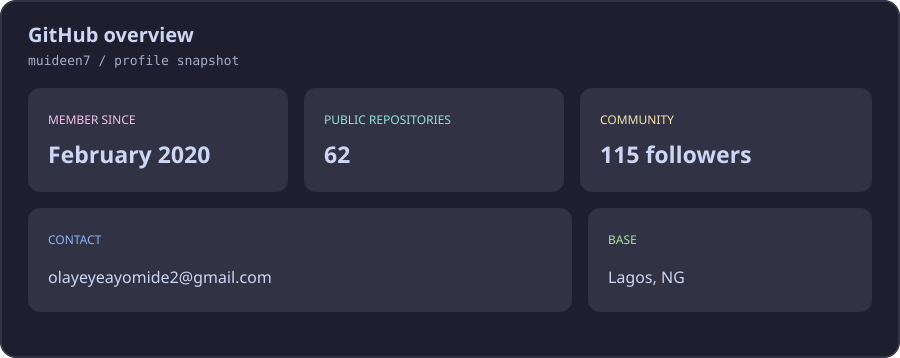

<h1>Olayeye Muideen</h1>

  

 

<code>░░░░░░░░░░░░░░░░░░░░░░░░░░░░░░░░░░░░░░░░░░░░░░░░░░░</code> 
<code>~/muideen7&nbsp;&nbsp;❯&nbsp;&nbsp;whoami</code> 
<code>Full-stack engineer · EEE background · Lagos, NG</code> 
<code>Building AI tools, SaaS products, and interfaces</code> 
<code>that feel considered, not templated.</code> 
<code>░░░░░░░░░░░░░░░░░░░░░░░░░░░░░░░░░░░░░░░░░░░░░░░░░░░</code>

 

  
  
  
  

---

<h3 align="center">✦ Featured Work ✦</h3>

<table align="center">
<tr>
<td width="33%" valign="top">

**🧠 DevMentor AI**
AI-powered mentorship for self-taught devs — roadmaps, code review, daily check-ins.

`Next.js` `MongoDB` `NextAuth` `AI`

[**↗ Live**](https://dev-mentor-nu.vercel.app/)

</td>
<td width="33%" valign="top">

**📊 Data.bes**
Digital marketing & data-analysis studio — SEO, analytics, content strategy.

`Next.js` `Tailwind` `TypeScript`

[**↗ Live**](https://databes.vercel.app/)

</td>
<td width="33%" valign="top">

**🖤 Deep^style**
Editorial streetwear storefront — categories, drops, style journal.

`Next.js` `Tailwind` `TypeScript`

[**↗ Live**](https://deepstyle-seven.vercel.app/)

</td>
</tr>
</table>

---

<h3 align="center">✦ Stack ✦</h3>

---

<h3 align="center">✦ Stats ✦</h3>

<table align="center" width="100%">
<tr>
<td width="50%" valign="top">

</td>
<td width="50%" valign="top">

</td>
</tr>
</table>

 

<h3 align="center">✦ Contribution Snake ✦</h3>

 

 

 

<b>Olayeye Muideen</b> · building products that are as functional as they are memorable

