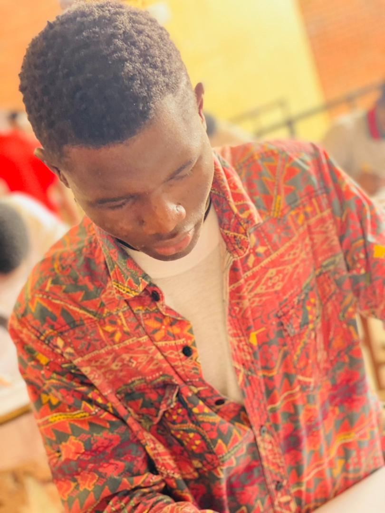

### Hello, I’m Ayomide
Web developer | Graphic Designer | Freelancer
I'm a junior web developer focusing on crafting user experiences and design systems for software, web, and mobile products.

<link rel="stylesheet" href="https://cdn.jsdelivr.net/npm/bootstrap@3.3.7/dist/css/bootstrap.min.css" integrity="sha384-BVYiiSIFeK1dGmJRAkycuHAHRg32OmUcww7on3RYdg4Va+PmSTsz/K68vbdEjh4u" crossorigin="anonymous">

<!--Comment out

-->
<!--

-->

### 🔭 I’m currently working on ... Upscaling my skills in front-end technologies
- 🌱 I’m currently learning ... software Engineering
- 👯 I’m looking to collaborate on ...Any open source front-end technologies projects
- 🤔 I’m looking for help with ... JavaScript and it's frameworks
- 💬 Ask me about ... Frontend development

### 🧑‍💻 Basics skills levels and languages..
<!-- stats and languages Chart -->

	
  	
    

<!-- Languages badges -->
<h3 align=center>Languages I use</h3>

  	
  	
  	
  	
  	
  	
  	
  	
  	
  	
  	
  	
  	
  	

 

📫 How to reach me: ...
 
 &nbsp;&nbsp;
 &nbsp;&nbsp;
 &nbsp;
 &nbsp;

<!-- connect badges -->
<h3 align=center>Let's Connect:</h3>

	
	

 

	
	

<!-- Frameworks I use -->
<h3 align=center>Other stuff I use</h3>

  	
  	
  	
	<!-- 	 -->
  	
  	
	
	
	<!-- 	 -->
  	
  	
  	
	<!-- 	 -->
  	
	<!-- 	 -->
  	
  	
  	
  	
	<!-- 	 -->
  	
  	
  	

###
⭐️ From [Ayomide Olayeye]  
(https://olayeyeayomide.netlify.app/)
 😄 Pronunciation: ... Ahhyormede
 ⚡ Fun fact: ... Am a number 7 person and all my name has 7 letters
 
...
###
 

  
